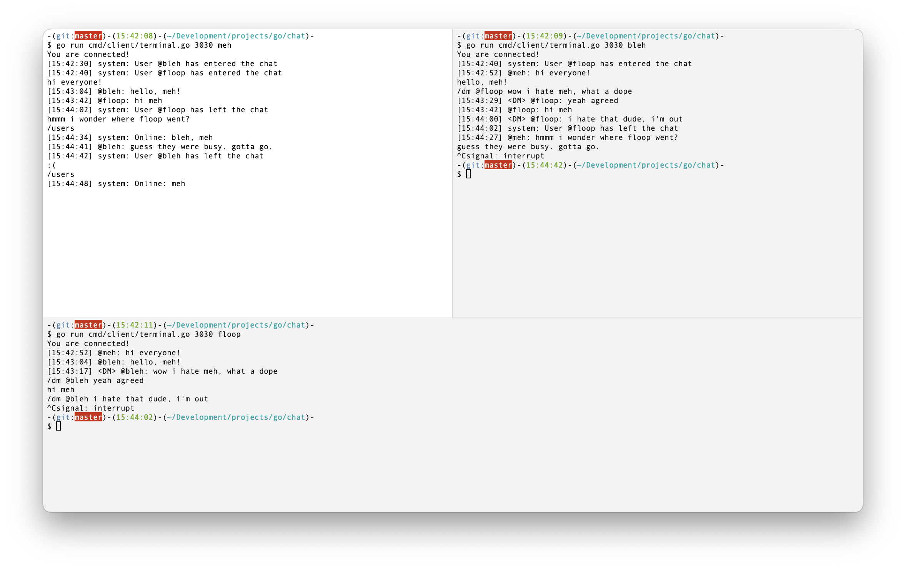

# golang chat
a useless chat server/client written in go, so i could try to learn stuff.



## architecture
### server
the server is at the top level. you could start it by running:
```bash
# 3030 is the port to start the server on
$ go run main.go 3030
```

a new server is started on that port, and waits for connections. the server takes in a set of handlers it can use
to handle incoming messages from clients.

### handlers
handlers are implemented as an interface. to be a handler, you must implement both a `Parse` and `Execute` function.
see more about handlers at [/server/handler.go](/server/handler.go).

### clients
a client should be implemented under [/cmd/client](/cmd/client). a [terminal client](/cmd/client/terminal.go) has been
provided. to start the terminal client, run:
```bash
# 3030 is the port to connect to, and kevin is the user you're connecting as
$ go run cmd/client/terminal.go 3030 kevin
```

## stuff i didn't care about
- if you give bad cli args, it will panic. i don't care.
- the message sending itself has a weird 1024 byte limit that i put in there. bad things will probably happen if you exceed it. i don't care.
- when i want to use it, i start up a server (locally), the open up multiple terminals (locally), and pretend i'm like 3 people. it's useless. i don't care.
- the [slash command handler](/server/slash.go) `Execute` function could be a whole thing in and of itself. i don't care.
- the [handshake package](/handshake/handshake.go)'s protocol for a user is terrible. i don't care.
- the same user could connect from multiple clients, and if they do, weird things happen. it's even weirder when one of them disconnects. i don't care.
- i'm doing a few console printouts in the server. i know i should use proper logging. i don't care.
- the terminal client i built is really ugly, and has no niceties like proper prompting or anything. i don't care.

## stuff i did care about
- i was trying to think about how someone good at go would lay things out in go, and do it like them. i may have failed, i don't know.
- i wanted to make some things in the `server` package public that don't need to be today, thinking about the whole notion of someone else implementing the `Handler` interface.
- the `handshake` thing might be a bit silly, but i was trying to think about a package that bridges the server/client.
- i wanted to learn new things and see if i could feel comfortable writing something that works without it being TOO huge a disaster, and without letting it take too long. my goal was about 4 hours, and i ran over by 3. maybe that's a failure in and of itself. i don't know.